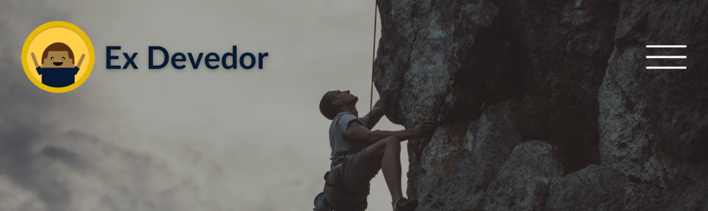

### **Plano de Ação - Encontro 9:** 

### **Planejamento Financeiro com Foco na Consolidação**

**Nome do Mentorado**

**Data de envio:**

**Data de entrega:**

---

#### **Objetivo do Plano de Ação:**

Estabelecer um conjunto claro de tarefas e um checklist prático para o mentorado consolidar os aprendizados, sustentar o progresso financeiro e avançar nas metas de longo prazo.

---

### **Tarefas do Encontro 9**

---

#### **1. Revisar o Orçamento Atual**

- **Tarefa:** Atualizar o orçamento mensal, incluindo receitas e despesas.
- **Checklist:** 
  - [ ]  Liste todas as receitas fixas e variáveis.
  - [ ]  Relacione despesas fixas (aluguel, contas) e variáveis (lazer, compras).
  - [ ]  Verifique se o orçamento reflete suas metas de quitação, poupança e investimentos.

---

#### **2. Avaliar o Progresso das Metas Financeiras**

- **Tarefa:** Revisar as metas de curto, médio e longo prazo.
- **Checklist:** 
  - [ ]  Identifique metas já alcançadas (ex.: dívidas quitadas).
  - [ ]  Atualize o status das metas em andamento (ex.: reserva de emergência).
  - [ ]  Estabeleça novas metas, se necessário, alinhadas à sua realidade atual.

---

#### **3. Planejar a Sustentação Financeira**

- **Tarefa:** Desenvolver estratégias para manter o progresso e evitar retrocessos financeiros.
- **Checklist:** 
  - [ ]  Crie uma rotina semanal para revisar receitas, despesas e metas.
  - [ ]  Mantenha o registro diário ou semanal dos gastos para evitar desvios.
  - [ ]  Verifique o progresso do fundo de emergência (ideal: 3 a 6 meses de despesas fixas).
  - [ ]  Defina formas de evitar novos endividamentos (ex.: evitar crédito rotativo).

---

#### **4. Introdução ao Investimento Inicial**

- **Tarefa:** Pesquisar opções simples de investimento e começar a planejar um aporte.
- **Checklist:** 
  - [ ]  Pesquise sobre investimentos básicos, como Tesouro Direto Selic ou CDBs.
  - [ ]  Identifique o valor que pode destinar mensalmente para investir.
  - [ ]  Abra uma conta em uma corretora de confiança, se ainda não tiver.

---

#### **5. Criar um Cronograma de Revisão Financeira**

- **Tarefa:** Estabelecer um cronograma fixo para revisar finanças e metas.
- **Checklist:** 
  - [ ]  Escolha um dia da semana ou do mês para revisar seu orçamento.
  - [ ]  Inclua no cronograma a atualização das metas e o monitoramento do fundo de emergência.
  - [ ]  Planeje revisões trimestrais para ajustar estratégias e investimentos.

---

### **Mensagem Final**

Consolidar suas finanças é tão importante quanto dar o primeiro passo. Com hábitos sólidos e metas claras, você não apenas mantém o progresso alcançado, mas também constrói um futuro financeiro sustentável. Mantenha o foco, e celebre cada conquista ao longo do caminho!

---

### **Resultados Esperados:**

- Um plano financeiro atualizado e alinhado às prioridades do mentorado.
- Desenvolvimento de hábitos sustentáveis de controle e revisão financeira.
- Introdução a práticas de poupança e investimento para crescimento de longo prazo.