# Roteiro da Palestra Ex Devedor: Vencendo os Boletos

Este documento apresenta o roteiro completo de 40 minutos para a palestra **Ex Devedor**, projetada especificamente para um público de **21 a 45 anos**. O foco da apresentação é **comportamental, prático e simples**, conectando as esferas do Passado (crenças e traumas), Presente (hábitos e a metáfora do tempo) e Futuro (sonhos e liberdade).

---

## 📋 Ficha Técnica da Palestra

*   **Título:** Ex Devedor: Vencendo os Boletos
*   **Tempo Total:** 40 minutos (cronometrados e divididos por blocos)
*   **Público-Alvo:** Jovens e adultos de 21 a 45 anos (trabalhadores, inseridos nas grandes capitais, dependentes de cartão de crédito e buscando estabilidade/realização de sonhos)
*   **Tom de Voz:** Empático, direto, realista, encorajador e sem jargões técnicos complexos
*   **Slogan de Destaque:** *"Dívidas não são resolvidas com dinheiro."*
*   **Identidade Visual Recomendada:**
    *   **Cores principais:** Laranja (`#DFA83F` - energia/modernidade), Amarelo (`#FCCF86` - otimismo/transparência), Azul Escuro (`#061A35` - segurança/seriedade) e Cinza Claro (`#E1E2E5` - neutralidade/base).
    *   **Fontes:** `Comixo Regular` ou `Lato Heavy` para títulos de impacto; `Lato` para textos de leitura.

---

## ⏱️ Divisão de Tempo (40 Minutos)

```mermaid
gantt
    title Divisão do Tempo da Palestra (40 Minutos)
    dateFormat  m
    axisFormat %M min
    section Palestra
    1. Introdução e Choque de Realidade (Slides 1-5)  :active, 0, 5
    2. O Futuro - Conexão com Sonhos (Slides 11-12)    : 5, 12
    3. O Presente - A Metáfora do Tempo (Slides 13, 17-18) : 12, 22
    4. O Passado - Crenças e Traumas (Slides 14-16)    : 22, 28
    5. A Revolução - Organização e Métodos (Slides 6-9, 19-24) : 28, 38
    6. Conclusão e Call to Action (Slide 25)          : 38, 40
```



*   **Minuto 00 a 05 (5 min):** Introdução e quebra de expectativas sobre "fórmulas mágicas" (Slides 1 a 5).
*   **Minuto 05 a 12 (7 min):** O Futuro (Sonhos e Propósito) (Slides 11 e 12).
*   **Minuto 12 a 22 (10 min):** O Presente (A dependência, a realidade financeira e a **Metáfora do Tempo**) (Slides 13, 17 e 18).
*   **Minuto 22 a 28 (6 min):** O Passado (Crenças limitantes, traumas familiares e a quebra do ciclo) (Slides 14, 15 e 16).
*   **Minuto 28 a 38 (10 min):** A Revolução Prática (A regra 60/30/10, o Método de 3 Passos e as 3 Estratégias de Quitação) (Slides 6 a 9 e 19 a 24).
*   **Minuto 38 a 40 (2 min):** Conclusão e Fechamento com o Slogan (Slide 25).

---

## 🎤 Roteiro Slide a Slide e Notas de Condução

### Bloco 1: Introdução e Choque de Realidade (00:00 - 05:00)

#### Slide 1: Capa da Palestra
*   **Texto Visual do Slide:**
    ```text
    EX DEVEDOR
    VENCENDO OS BOLETOS
    ```
*   **Notas Visuais:** Fundo Azul Escuro (`#061A35`) com letras em Laranja (`#DFA83F`) e Amarelo (`#FCCF86`). Design limpo, transmitindo profissionalismo e modernidade.
*   **Orientação de Linguagem Corporal:** Entre no palco com energia, sorria, faça contato visual direto com a plateia. Sem pressa para falar, sinta o ambiente.
*   **Fala Sugerida (1 min):**
    > "Olá, boa noite a todos! É um prazer enorme estar aqui hoje com vocês. Sejam muito bem-vindos à palestra **Ex Devedor: Vencendo os Boletos**. Deixa eu adivinhar uma coisa: quem aqui dentro desta sala já sentiu um frio na barriga ao abrir a caixa de correio ou a aba de notificações do banco? Quem aqui sente que trabalha, trabalha, trabalha, mas no final do mês parece que sobrou apenas mais mês do que dinheiro? Se você se identifica com isso, saiba que você não está sozinho. E o meu objetivo nos próximos 40 minutos é te mostrar que existe uma saída simples, prática e real para essa situação."

---

#### Slide 2: O Mito das Soluções Rápidas
*   **Texto Visual do Slide:**
    ```text
    SAIR DAS DÍVIDAS NÃO É TAREFA FÁCIL.
    
    Se fosse assim, bastava assistir a um vídeo de YouTube
    ou seguir um tutorial comum no Instagram para seus 
    problemas serem solucionados.
    ```
*   **Notas Visuais:** Elementos em cinza e laranja. Destaque para a palavra **"FÁCIL"** riscada ou em contraste.
*   **Orientação de Linguagem Corporal:** Expressão séria, porém acolhedora. Gestos de negação suaves com as mãos para desmistificar as falsas promessas da internet.
*   **Fala Sugerida (1 min):**
    > "A primeira coisa que precisamos alinhar aqui hoje é a verdade. Sair das dívidas não é fácil. E eu preciso começar sendo honesto com vocês: se fosse fácil, se fosse apenas uma questão de baixar uma planilha ou assistir a um vídeo de 5 minutos no YouTube, ninguém mais estaria endividado no Brasil. O Instagram está cheio de gurus prometendo fórmulas mágicas de enriquecimento rápido. Mas a verdade é que a vida real acontece longe das telas. O buraco é mais embaixo, e o caminho exige mais do que apenas dicas rasas."

---

#### Slide 3: O Caminho e o Pedido
*   **Texto Visual do Slide:**
    ```text
    HOJE QUERO TE MOSTRAR UM CAMINHO 
    SIMPLES E FÁCIL DE PÔR EM PRÁTICA.
    
    Porém, para que esse método faça efeito,
    preciso de uma única coisa...
    ```
*   **Notas Visuais:** O tom do slide muda para o Amarelo/Laranja, trazendo mais luz e otimismo. A frase final fica em suspenso para criar expectativa.
*   **Fala Sugerida (1 min):**
    > "Mas veja bem: embora não seja 'fácil' no sentido de ser mágico, o caminho que eu vou te mostrar hoje é **simples** e **prático**. Eu não vou falar aqui de termos econômicos complicados, de inflação ou de investimentos mirabolantes que você não entende. Nós vamos falar de ações cotidianas. Mas para que esse método funcione na sua vida, eu preciso que você me dê uma única coisa a partir de agora..."

---

#### Slide 4: O Pilar Fundamental
*   **Texto Visual do Slide:**
    ```text
    DISCIPLINA
    ```
*   **Notas Visuais:** Apenas esta palavra centralizada em fonte gigante (`Comixo Regular` ou `Lato Heavy`), em Laranja (`#DFA83F`) sobre fundo Azul Escuro (`#061A35`). Impacto visual máximo.
*   **Orientação de Linguagem Corporal:** Faça uma pausa de 3 segundos em silêncio. Aponte para a tela. Fale a palavra com firmeza e clareza.
*   **Fala Sugerida (1 min):**
    > "...Disciplina. Sem floreios. Disciplina é fazer o que precisa ser feito, mesmo nos dias em que você não está com a menor vontade. É a ponte entre a situação em que você está hoje e a vida que você quer construir amanhã."

---

#### Slide 5: A Realidade Sem Disciplina
*   **Texto Visual do Slide:**
    ```text
    SEM DISCIPLINA VOCÊ NÃO CHEGA EM
    LUGAR NENHUM, E ISSO INCLUI
    SAIR DAS DÍVIDAS.
    ```
*   **Notas Visuais:** Contraste sóbrio. Uso de margens limpas.
*   **Fala Sugerida (1 min):**
    > "Não adianta eu te entregar o melhor método do mundo hoje se, ao sair por aquela porta, você voltar a viver no piloto automático. Sem disciplina, você continuará patinando, trocando um boleto por outro, e vivendo refém das suas próprias escolhas por impulso. A disciplina é o seu escudo contra o endividamento."

---

### Bloco 2: O Futuro - Conexão com Sonhos (05:00 - 12:00)

#### Slide 11: A Jornada da Palestra
*   **Texto Visual do Slide:**
    ```text
    1 - FUTURO
    2 - PRESENTE
    3 - PASSADO
    4 - REVOLUÇÃO
    
    PERA AÍ... O Futuro vem primeiro?
    ```
*   **Notas Visuais:** O slide lista os tópicos de forma invertida cronologicamente. O "PERA AÍ..." aparece destacado em amarelo.
*   **Orientação de Linguagem Corporal:** Expressão de questionamento lúdico. Sorria, ande um pouco pelo palco para descontrair.
*   **Fala Sugerida (2 min):**
    > "Agora, olhem para a tela. Essa é a nossa jornada de hoje: Futuro, Presente, Passado e a nossa Revolução. E você deve estar se perguntando: 'Pera aí, por que começar pelo Futuro? O lógico não seria olhar para o passado primeiro?'. 
    > A resposta é puramente comportamental. Se eu começar mostrando as suas dívidas e os seus erros passados, você vai sair daqui desmotivado, se sentindo culpado. Nós precisamos entender **por quem** ou **pelo que** estamos lutando. Nós precisamos mirar no alvo antes de puxar o arco. Por isso, começamos desenhando o seu futuro."

---

#### Slide 12: Desenhando o Futuro
*   **Texto Visual do Slide:**
    ```text
    FUTURO
    
    • Onde você quer chegar?
    • Qual é o seu maior sonho hoje?
    • Como o dinheiro pode te ajudar a realizá-lo?
    ```
*   **Notas Visuais:** Slide limpo, com ícones sutis representando sonhos (ex: uma casa, uma viagem, uma família tranquila). Cores suaves.
*   **Orientação de Linguagem Corporal:** Fale de forma mais mansa e inspiradora. Abra os braços para sugerir possibilidades.
*   **Fala Sugerida (5 min):**
    > "Feche os olhos por três segundos. Pense no seu maior sonho hoje. É comprar a sua casa própria? É fazer aquela viagem internacional que você planeja há anos? É dar uma escola melhor para os seus filhos? Ou simplesmente ter a paz de espírito de deitar a cabeça no travesseiro sabendo que todas as contas estão pagas e sobrou dinheiro na conta? 
    > O dinheiro não é o fim, ele é o meio. Ele é uma ferramenta de construção. Quando você entende que organizar suas finanças não é sobre 'se privar de viver', mas sim sobre **garantir que seus sonhos reais aconteçam**, tudo muda. A privação temporária ganha um propósito grandioso."

---

### Bloco 3: O Presente e a Metáfora do Tempo (12:00 - 22:00)

#### Slide 13: O Diagnóstico do Presente
*   **Texto Visual do Slide:**
    ```text
    PRESENTE
    
    • O que você tem feito para chegar nesse futuro?
    • Como você está usando o seu dinheiro hoje?
    • O que é dinheiro para você?
    ```
*   **Notas Visuais:** Transição para cores um pouco mais frias (Azul e Cinza) para trazer sobriedade.
*   **Orientação de Linguagem Corporal:** Aproxime-se da plateia. Tom de voz reflexivo, gerando autorresponsabilidade.
*   **Fala Sugerida (3 min):**
    > "Agora que sabemos onde queremos chegar no futuro, precisamos olhar para onde estamos pisando hoje. No presente. E a pergunta é dolorosa: o que você tem feito no seu dia a dia para garantir que aquele sonho aconteça? Ou você está apenas sobrevivendo ao mês corrente? Como você usa seu dinheiro hoje? Ele some da sua conta no dia 5 e você passa o resto do mês empurrando despesas no cartão de crédito? Para responder a isso, precisamos fazer uma pergunta filosófica, mas extremamente prática: o que é o dinheiro para você?"

---

#### Slide 10 (Recuperado / Destaque): A Metáfora do Tempo
*   **Texto Visual do Slide:**
    ```text
    O DINHEIRO É O RESULTADO DO SEU TEMPO
    
    • Tempo vendido quando trabalhamos.
    • Tempo valorizado quando estudamos e nos especializamos.
    
    "Se eu não respeito meu tempo, não respeito meu 
    dinheiro e nem a história que construí."
    ```
*   **Notas Visuais:** Slide extremamente elegante. Fundo escuro com uma imagem minimalista de um relógio de areia (ampulheta) ou engrenagens sutis. A frase final em destaque Laranja/Amarelo.
*   **Orientação de Linguagem Corporal:** Fique no centro do palco. Diminua o ritmo da fala. Faça pausas dramáticas. Olhe nos olhos das pessoas. Este é o coração comportamental da palestra.
*   **Fala Sugerida (7 min):**
    > "Quero propor uma mudança drástica na forma como você enxerga a sua carteira. O dinheiro que você tem ou não tem hoje não é apenas papel, pix ou um limite no aplicativo. **Dinheiro é tempo.** 
    > Pense comigo: quando você aceita um emprego, você está vendendo horas da sua vida que nunca mais vão voltar. Você vende o seu tempo por um salário. Quando você decide estudar, fazer um curso, se especializar, você está investindo para que a sua hora de trabalho fique mais cara, mais valorizada. 
    > Portanto, cada real que entra na sua conta representa uma fatia da sua vida. Representa o tempo que você ficou longe da sua família, o tempo que você passou cansado no trânsito, o tempo em que você se dedicou a produzir algo. 
    > Se você gasta o seu dinheiro com coisas que não fazem sentido, se você compra por impulso para agradar pessoas que você nem gosta, ou se você entrega o seu dinheiro de mão beijada para o banco em forma de juros abusivos de cartão de crédito... você não está apenas desperdiçando dinheiro. **Você está desperdiçando a sua própria vida.** Você está desrespeitando o seu tempo, a sua energia e a história que você construiu para conseguir aquele valor. 
    > Respeitar o seu dinheiro é, antes de tudo, ter amor-próprio e respeitar o seu próprio tempo na Terra."

---

### Bloco 4: O Passado - Crenças e Traumas (22:00 - 28:00)

#### Slide 14: Olhando para Trás
*   **Texto Visual do Slide:**
    ```text
    PASSADO
    
    • Como sua família lidava com dinheiro?
    • Quem é o seu exemplo financeiro?
    • Entenda a raiz de como você se endividou.
    ```
*   **Notas Visuais:** Cores suaves, transmitindo empatia. 
*   **Orientação de Linguagem Corporal:** Tom de voz suave, acolhedor. Evite qualquer tom de julgamento. Mostre vulnerabilidade (se puder, conte uma rápida história pessoal de infância sobre dinheiro).
*   **Fala Sugerida (3 min):**
    > "E de onde vem a forma como lidamos com dinheiro hoje? Vem do nosso Passado. Nós não nascemos sabendo usar cartão de crédito ou fazer orçamento. Nós aprendemos observando os adultos à nossa volta quando éramos crianças. 
    > Lembre-se da sua infância. O que você ouvia sobre dinheiro? Era: 'Dinheiro não dá em árvore', 'Dinheiro é sujo', ou 'Isso não é para o nosso bico'? Você via seus pais brigando por causa de contas? Você cresceu com a sensação de que o dinheiro é um monstro difícil de domar? 
    > Muitos de nós carregamos traumas silenciosos. Desenvolvemos crenças limitantes, como achar que nascemos para ser pobres ou que a única forma de ter as coisas é se endividando no carnê ou no cartão. Para mudar o presente, precisamos entender e acolher essa raiz."

---

#### Slide 15: Quebrando o Ciclo
*   **Texto Visual do Slide:**
    ```text
    PARA QUEBRAR
    
    O ciclo das crenças limitantes e dos
    erros repetidos termina aqui.
    ```
*   **Notas Visuais:** Slide de alto impacto. Imagem conceitual de correntes se quebrando ou uma luz forte se acendendo.
*   **Fala Sugerida (1 min):**
    > "Identificar essas lembranças não serve para culpar nossos pais ou nosso passado. Eles fizeram o melhor que podiam com o conhecimento que tinham. Serve para que você decida, conscientemente, que esse ciclo de reclamação, escassez e desorganização termina aqui. Você tem o poder de reescrever a sua história financeira a partir de hoje."

---

#### Slide 16: A Mente que Vence
*   **Texto Visual do Slide:**
    ```text
    MENTE
    QUE VENCE OS BOLETOS
    ```
*   **Notas Visuais:** Transição visual para a fase de ação. Destaque para a palavra **MENTE**.
*   **Fala Sugerida (2 min):**
    > "Para vencer os boletos na prática, precisamos primeiro mudar a mentalidade. Precisamos migrar da mente de quem apenas consome e deve para a mente de quem constrói e realiza. Vamos entender a diferença gritante entre esses dois padrões de pensamento."

---

#### Slide 17: O Espelho do Devedor
*   **Texto Visual do Slide:**
    ```text
    MENTALIDADE DE DEVEDOR
    
    • Foco apenas no problema      • Pouco poder de decisão
    • Trabalha só para pagar conta  • Sempre apaga incêndios
    • Nunca tem dinheiro           • Não investe e não tem planos
    
    "Mata um leão por dia para sobreviver."
    ```
*   **Notas Visuais:** Um design claro comparativo ou em tópicos destacados, com uma linha marcante.
*   **Fala Sugerida (1 min):**
    > "Essa lista descreve a Mentalidade do Devedor. Veja se você se reconhece em algum ponto: você acorda todo dia apenas para 'matar um leão', trabalhando para pagar as contas que já venceram. Você não tem planos para daqui a 5 anos porque não sabe como vai pagar a semana que vem. Você se sente sem poder de escolha, aceitando qualquer juro ou tarifa porque está sempre no desespero de apagar o próximo incêndio. Essa mentalidade nos mantém presos na roda de hamster da escassez."

---

### Bloco 5: A Revolução Prática (28:00 - 38:00)

#### Slide 18: O Fluxo Invisível
*   **Texto Visual do Slide:**
    ```text
    PERCEBA O FLUXO
    
    • Gastos por impulso (compensação emocional)
    • Gastos no piloto automático (assinaturas, rotina)
    • Gastos invisíveis (taxas, pequenos excessos)
    
    Olhe com atenção para onde o seu tempo está escorrendo.
    ```
*   **Notas Visuais:** Ícones minimalistas para cada tipo de gasto. Uso de setas indicando vazamento de recursos.
*   **Fala Sugerida (2 min):**
    > "A nossa revolução prática começa com clareza. Você precisa perceber o fluxo do seu dinheiro. O dinheiro vaza de três formas principais: gastos por impulso (quando você teve um dia ruim no trabalho e decide 'se presentear' com uma compra cara que não precisava), gastos no piloto automático (serviços que você não usa mais, planos caros que poderiam ser renegociados) e gastos invisíveis (aquelas tarifas bancárias de 30 reais que você deixa passar, os pequenos lanches diários que somados dão centenas de reais). A partir de hoje, você vai olhar para o seu extrato e enxergar o seu tempo escorrendo por esses ralos."

---

#### Slide 19: Ação Imediata
*   **Texto Visual do Slide:**
    ```text
    ORGANIZE
    
    1. Defina seus gastos fixos.
    2. Corte o que não faz sentido manter.
    3. Ajuste o que pode ser ajustado.
    ```
*   **Notas Visuais:** Cores vibrantes (Laranja e Amarelo), passando sensação de energia e controle.
*   **Fala Sugerida (1 min):**
    > "O primeiro passo prático é a organização: liste os seus gastos fixos (moradia, energia, alimentação essencial). Em seguida, faça uma limpa: corte tudo aquilo que não faz sentido ou que você nem lembra que está pagando. Por fim, ajuste: negocie o plano de internet, mude para um banco que não te cobra tarifa de conta, substitua marcas caras no supermercado. Pequenos ajustes geram grandes sobras ao final do ano."

---

#### Slide 20: Crie Limites para o seu Dinheiro
*   **Texto Visual do Slide:**
    ```text
    CRIE LIMITES PARA O SEU DINHEIRO
    
    • 60% para o Presente (Custo de Vida)
    • 30% para o Passado (Dívidas, Empréstimos e Cartão)
    • 10% para o Futuro (Sonhos e Reserva)
    ```
*   **Notas Visuais:** Gráfico de pizza simples ou blocos de proporção coloridos correspondentes às porcentagens (60% Presente, 30% Passado, 10% Futuro). Muito visual e fácil de ler de longe.
*   **Orientação de Linguagem Corporal:** Gestos delimitadores com as mãos para ilustrar os "limites" (as gavetas do dinheiro).
*   **Fala Sugerida (2 min):**
    > "Para não se perder mais, nós criamos limites claros. O dinheiro precisa de regras, senão ele vai para onde o vento soprar. A metodologia do Ex Devedor propõe uma divisão simples baseada no tempo: 60% para o seu Presente, 30% para quitar o seu Passado e 10% para blindar e planejar o seu Futuro. Vamos ver o que entra em cada gaveta."

---

#### Slide 22 (Invertido para fluxo didático): A Gaveta do Presente
*   **Texto Visual do Slide:**
    ```text
    60% PRESENTE (Custo de Vida)
    
    • Alimentação       • Saúde
    • Moradia           • Transporte
    • Educação          • Lazer
    • Baldes Sazonais (IPVA, IPTU, datas comemorativas)
    ```
*   **Notas Visuais:** Destaque para a categoria **"Baldes Sazonais"** com uma cor diferente para chamar a atenção.
*   **Fala Sugerida (1 min):**
    > "Os 60% do Presente devem cobrir todo o seu custo de vida essencial e também o seu lazer. Aqui entra aluguel, mercado, transporte, saúde e educação. E um ponto fundamental: os 'baldes sazonais'. O que é isso? São aqueles gastos que não acontecem todo mês, mas que você sabe que vão chegar, como o IPVA em janeiro, o seguro do carro ou presentes de fim de ano. Se você não se planeja mensalmente para eles, eles se tornam novas dívidas no presente."

---

#### Slide 23 (Invertido para fluxo didático): A Gaveta do Passado
*   **Texto Visual do Slide:**
    ```text
    30% PASSADO (O Preço das Escolhas)
    
    • Empréstimos
    • Parcelamentos de Dívidas
    • Faturas Acumuladas do Cartão de Crédito
    ```
*   **Notas Visuais:** Tom sóbrio. Um lembrete visual de que o passado consome o presente se não for estancado.
*   **Fala Sugerida (1 min):**
    > "Os 30% do Passado são dedicados exclusivamente a pagar o preço das escolhas que você já fez. Aqui entram as parcelas de empréstimos, acordos de dívidas antigas e aquela bola de neve do cartão de crédito. Se você está usando mais do que 30% da sua renda para pagar o passado, o seu presente fica esmagado e você entra no desespero. O nosso plano é enquadrar suas dívidas dentro deste limite e quitá-las estrategicamente."

---

#### Slide 21 (Invertido para fluxo didático): A Gaveta do Futuro
*   **Texto Visual do Slide:**
    ```text
    10% FUTURO (A sua Segurança)
    
    • Sonhos e Metas de longo prazo
    • Objetivos de vida
    • Reserva Financeira de Emergência
    ```
*   **Notas Visuais:** Cores alegres (Amarelo/Dourado e Laranja). Sensação de recompensa e segurança.
*   **Fala Sugerida (1 min):**
    > "E finalmente, 10% do seu dinheiro vai para o seu Futuro. Esta é a parte mais importante, porque é ela que garante que você nunca mais volte a ser um devedor. É aqui que você constrói a sua Reserva de Emergência para imprevistos e guarda o dinheiro carimbado para realizar aqueles sonhos que desenhamos no começo da nossa conversa."

---

#### Slide 6 (Recuperado): O Método Ex Devedor
*   **Texto Visual do Slide:**
    ```text
    O MÉTODO
    
    1. LISTAR (O Raio-X)
    2. ORDENAR (A Hierarquia)
    3. PAGAR (A Execução)
    ```
*   **Notas Visuais:** Estrutura em três passos com numerais grandes e limpos.
*   **Fala Sugerida (1 min):**
    > "Agora você já tem a mentalidade e sabe como dividir seu orçamento. Mas como sair das dívidas que existem hoje de forma prática? Nós aplicamos o Método Ex Devedor, que consiste em três passos simples: Listar, Ordenar e Pagar. Vamos detalhar cada um deles."

---

#### Slide 7: Passo 1 - Listar
*   **Texto Visual do Slide:**
    ```text
    1. LISTAR
    
    Levantar absolutamente todas as dívidas.
    Colocar luz onde havia escuridão.
    ```
*   **Notas Visuais:** Apelo visual à clareza (ex: uma lanterna iluminando uma lista de contas).
*   **Fala Sugerida (1 min):**
    > "O primeiro passo é Listar. Você precisa abrir as cartas, acessar os aplicativos e anotar tudo. Valor total, taxa de juros, quem é o credor. Muitas pessoas não saem das dívidas porque têm medo de olhar para o tamanho do problema. Elas ignoram as ligações de cobrança e fingem que a dívida não existe. Mas você não consegue vencer um inimigo que você se recusa a olhar nos olhos. Listar é colocar luz na escuridão."

---

#### Slide 8: Passo 2 - Ordenar
*   **Texto Visual do Slide:**
    ```text
    2. ORDENAR
    
    Definir a hierarquia de quitação com base na estratégia:
    
    • Método Avalanche (Foco na Matemática)
    • Método Bola de Neve (Foco na Motivação)
    • Método Dívidas Sem Dor (Foco no Emocional)
    ```
*   **Notas Visuais:** Três caixas comparativas explicativas das estratégias de quitação.
*   **Fala Sugerida (3 min):**
    > "O segundo passo é Ordenar. Nem todas as dívidas são iguais. Você não deve simplesmente pagar a primeira que aparecer ou a que cobrar mais alto no telefone. Você precisa de estratégia. Nós usamos três formas de ordenar:
    > 
    > 1. **Método Avalanche:** Você ordena as dívidas pela maior taxa de juros. Matematicamente é o melhor método, pois você mata primeiro a dívida mais cara (como o cheque especial ou cartão de crédito rotativo), economizando muito dinheiro de juros no longo prazo.
    > 
    > 2. **Método Bola de Neve:** Você ordena do menor valor de dívida para o maior. Você foca em quitar rapidamente as continhas pequenas para ver o número de credores diminuir. Comportamentalmente é excelente porque te dá pequenas vitórias rápidas, gerando ânimo para continuar a jornada.
    > 
    > 3. **Método Dívidas Sem Dor:** Você ordena pelo impacto emocional. Qual dívida tira o seu sono? É aquela com o seu irmão, com o seu melhor amigo ou com o agiota? Às vezes, o juro dessa dívida é zero, mas a pressão psicológica e o desgaste familiar são imensos. Nesse método, priorizamos a sua paz de espírito para depois cuidar das contas comerciais."

---

#### Slide 9: Passo 3 - Pagar
*   **Texto Visual do Slide:**
    ```text
    3. PAGAR
    
    Quitar conforme a ordem definida.
    Negociar com inteligência e manter a consistência.
    ```
*   **Notas Visuais:** Ícone de aperto de mãos (negociação) ou carimbo de "Pago".
*   **Fala Sugerida (1 min):**
    > "O terceiro passo é Pagar. Com a sua lista pronta e ordenada pela estratégia escolhida, você foca todos os seus esforços extras (os 30% do Passado e qualquer renda extra que conseguir) na primeira dívida da lista. As outras você mantém no pagamento mínimo ou aguarda para negociar. Quando a primeira dívida for eliminada, todo o recurso que você usava para pagá-la é somado para atacar a segunda da lista. Esse é o efeito cascata."

---

#### Slide 24: O Plano de Ação
*   **Texto Visual do Slide:**
    ```text
    PLANO DE AÇÃO IMEDIATO
    
    1. Escolha UM sonho claro para realizar.
    2. Abra uma conta separada apenas para poupar o Futuro.
    3. Defina o seu orçamento limite (60/30/10).
    4. Aplique o Método Ex Devedor nas suas contas.
    ```
*   **Notas Visuais:** Layout com checklist funcional. Números grandes em destaque.
*   **Fala Sugerida (2 min):**
    > "Para não sairmos daqui apenas com ideias bonitas na cabeça, vamos desenhar o seu Plano de Ação para as próximas 24 horas:
    > 
    > Primeiro: defina um sonho claro e coloque preço e data nele.
    > Segundo: crie uma conta em um banco digital gratuito diferente do seu banco principal. Essa será a conta do seu Futuro. Os 10% vão para lá e você não encosta neles para gastos diários.
    > Terceiro: mapeie sua renda e defina os limites de 60% para o Presente e 30% para o Passado.
    > Quarto: monte a sua planilha de dívidas hoje mesmo e escolha a sua estratégia de ordenação."

---

### Bloco 6: Conclusão e Call to Action (38:00 - 40:00)

#### Slide 25: Encerramento
*   **Texto Visual do Slide:**
    ```text
    "Dívidas não são resolvidas com dinheiro."
    
    A educação financeira salvou a minha vida. Graças 
    a ela, realizei muitos sonhos e desejos.
    É exatamente isso que desejo para você hoje.
    
    @ExDevedor | exdevedor.com
    ```
*   **Notas Visuais:** Slide de encerramento impactante. Logotipo EX DEVEDOR bem visível, dados de contato e redes sociais no rodapé. Fundo escuro com letras laranja e amarelo.
*   **Orientação de Linguagem Corporal:** Fique estático no centro do palco. Fale com emoção verdadeira e gratidão. Agradeça com uma reverência simples e aguarde os aplausos.
*   **Fala Sugerida (2 min):**
    > "Para fechar o nosso encontro, quero que gravem no coração a frase mais importante do Ex Devedor: **Dívidas não são resolvidas com dinheiro.** Elas são resolvidas com comportamento, com escolhas conscientes e com respeito ao seu próprio tempo de vida. 
    > Se você der mais dinheiro para quem não sabe gerenciar o que tem hoje, essa pessoa apenas arrumará dívidas maiores. A mudança que você precisa está na sua mente, nos seus hábitos diários. A educação financeira salvou a minha vida, me tirou do fundo do poço e me permitiu realizar os sonhos que eu achei que nunca alcançaria. Eu quero que ela faça o mesmo por você. 
    > Muito obrigado a todos, uma excelente noite e comecem a revolução de vocês hoje mesmo!"
